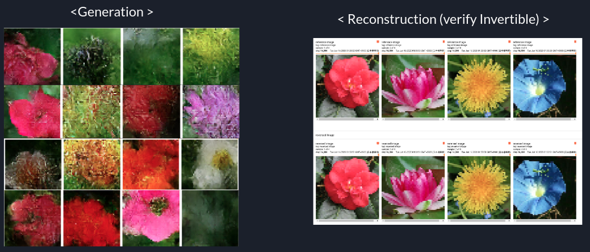

# Table of Contents

1.  [What&rsquo;s this repository?](#org372be00)
2.  [Zen of this repository](#orge1315f8)
3.  [How to use?](#org49e546f)
    1.  [By Install](#orgb151988)
    2.  [Source build for development](#org303c0cb)
4.  [Examples](#org32f06e9)
5.  [Roadmap](#orgf1b2c5c)
6.  [Remarkable Backlog](#org519ea1b)
    1.  [News [2020/6/16]](#org4eabf28)
7.  [Contact](#org7aa9ed4)

# What&rsquo;s this repository?

This is a repository for some researcher to build some Generative models using Tensorflow 2.x.

I NEED YOUR HELP(please let me know about formula, implementation and anything you worried)

# Zen of this repository

    We don't want to need flexible architectures.
    We need strict definitions for shapes, parameters, and formulas.
    We should Implement correct codes with well-documented(tested).

# How to use?

## By Install

-   pipenv
    
        pipenv install TFGENZOO==1.2.4.post4

-   pip
    
        pip install TFGENZOO==1.2.4.post4

## Source build for development

1.  clone this repository (If you want to do it, I will push this repository to PYPI)
2.  build this repository `docker-compose build`
3.  run the environment `sh run_script.sh`
4.  connect it via VSCode or Emacs or vi or anything.

# Examples

-   [TFGENZOOEXAMPLE](https://github.com/MokkeMeguru/TFGENZOO_EXAMPLE)

# Roadmap

-   [X] Flow-based Model Architecture (RealNVP, Glow)
-   [ ] i-ResNet Model Architecture (i-ResNet, i-RevNet)
-   [ ] GANs Model Architecture (GANs)

# Remarkable Backlog

Whole backlog is [here](https://github.com/MokkeMeguru/TFGENZOO/wiki/Backlog)

## News [2020/6/16]

New training results [Oxford-flower102](https://www.tensorflow.org/datasets/catalog/oxford_flowers102) with only 8 hours! (Quadro P6000 x 1)

<table border="2" cellspacing="0" cellpadding="6" rules="groups" frame="hsides">

<colgroup>
<col  class="org-left" />

<col  class="org-right" />

<col  class="org-right" />

<col  class="org-left" />
</colgroup>
<thead>
<tr>
<th scope="col" class="org-left">data</th>
<th scope="col" class="org-right">NLL(test)</th>
<th scope="col" class="org-right">epoch</th>
<th scope="col" class="org-left">pretrained</th>
</tr>
</thead>

<tbody>
<tr>
<td class="org-left">Oxford-flower102</td>
<td class="org-right">4.590211391448975</td>
<td class="org-right">1024</td>
<td class="org-left">---</td>
</tr>
</tbody>
</table>

see more detail, you can see [my internship&rsquo;s report](https://docs.google.com/presentation/d/12z6MZizIsytLxUb2ly7vYorFiKruIGZ2ckQ0-By4b6s/edit?usp=sharing) (Japanese only, if you need translated version, please contact me.)

# Contact

MokkeMeguru ([@MokkeMeguru](https://twitter.com/MeguruMokke)): DM or Mention Please (in Any language).

